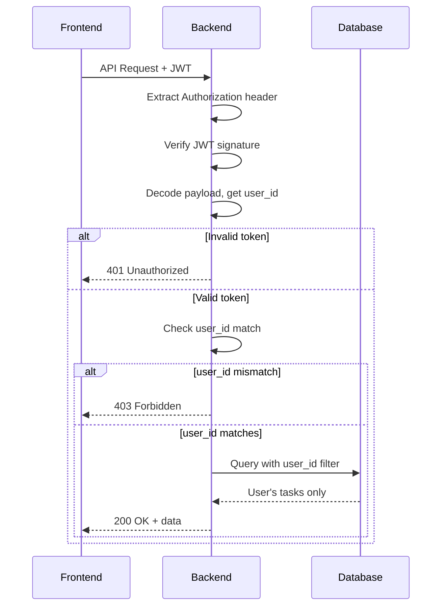

# REST API Specification

This document defines the REST API endpoints for the Full-Stack Todo Web Application, Phase II of "The Evolution of Todo" project.

## Overview

| Attribute | Value |
|-----------|-------|
| **API Version** | 2.0.0 |
| **Phase** | Phase II (Full-Stack Web) |
| **Framework** | FastAPI |
| **Format** | JSON |
| **Status** | Draft |

---

## Base URLs

| Environment | URL |
|-------------|-----|
| **Development** | `http://localhost:8000` |
| **Production** | `https://api.yourdomain.com` |

---

## Authentication

### Authentication Required

All API endpoints require a valid JWT token in the Authorization header.

```http
Authorization: Bearer <jwt_token>
```

### Token Requirements

| Requirement | Details |
|-------------|---------|
| **Format** | Bearer token (JWT) |
| **Header Name** | Authorization |
| **Algorithm** | HS256 |
| **Expiration** | 7 days from issue |

### Unauthorized Response

```json
{
  "detail": "Could not validate credentials"
}
```

---

## Common Response Codes

| Code | Name | Description |
|------|------|-------------|
| 200 | OK | Success |
| 201 | Created | Resource successfully created |
| 204 | No Content | Success with no response body |
| 400 | Bad Request | Validation error or invalid input |
| 401 | Unauthorized | Missing or invalid JWT token |
| 403 | Forbidden | Accessing another user's resource |
| 404 | Not Found | Resource does not exist |
| 500 | Internal Server Error | Server error |

---

## Error Response Format

All errors return a consistent JSON response:

```json
{
  "detail": "Error message describing what went wrong"
}
```

### Error Examples

**Validation Error (400):**
```json
{
  "detail": [
    {
      "loc": ["body", "title"],
      "msg": "field required",
      "type": "value_error.missing"
    }
  ]
}
```

**Unauthorized (401):**
```json
{
  "detail": "Could not validate credentials"
}
```

**Forbidden (403):**
```json
{
  "detail": "Not authorized to access this user's data"
}
```

**Not Found (404):**
```json
{
  "detail": "Task not found"
}
```

---

## Task Endpoints

### Base Path

```
/api/{user_id}/tasks
```

### 1. List All Tasks

**Endpoint:** `GET /api/{user_id}/tasks`

**Description:** Retrieve all tasks for the authenticated user.

---

**Path Parameters:**

| Parameter | Type | Required | Description |
|-----------|------|----------|-------------|
| user_id | string | Yes | Must match authenticated user's ID from JWT |

---

**Query Parameters (Optional):**

| Parameter | Type | Default | Description |
|-----------|------|---------|-------------|
| status | string | "all" | Filter by status: "all", "pending", "completed" |
| sort | string | "created" | Sort field: "created", "title", "updated" |
| order | string | "desc" | Sort order: "asc", "desc" |
| limit | integer | 100 | Maximum number of results |
| offset | integer | 0 | Number of results to skip |

---

**Example Request:**

```http
GET /api/user_123/tasks?status=pending&sort=created&order=desc HTTP/1.1
Host: localhost:8000
Authorization: Bearer <jwt_token>
```

---

**Success Response (200):**

```json
[
  {
    "id": 1,
    "user_id": "user_123",
    "title": "Buy groceries",
    "description": "Milk, eggs, bread",
    "priority": "medium",
    "completed": false,
    "created_at": "2024-01-15T10:30:00Z",
    "updated_at": "2024-01-15T10:30:00Z"
  },
  {
    "id": 2,
    "user_id": "user_123",
    "title": "Complete project proposal",
    "description": "Review and submit the final proposal",
    "priority": "high",
    "completed": false,
    "created_at": "2024-01-14T09:00:00Z",
    "updated_at": "2024-01-15T11:45:00Z"
  }
]
```

---

**Error Responses:**

| Status | Scenario |
|--------|----------|
| 401 | Missing or invalid token |
| 403 | user_id doesn't match authenticated user |
| 500 | Internal server error |

---

### 2. Create Task

**Endpoint:** `POST /api/{user_id}/tasks`

**Description:** Create a new task for the authenticated user.

---

**Path Parameters:**

| Parameter | Type | Required | Description |
|-----------|------|----------|-------------|
| user_id | string | Yes | Must match authenticated user's ID from JWT |

---

**Request Body:**

```json
{
  "title": "Task title (required, 1-200 chars)",
  "description": "Task description (optional, max 1000 chars)",
  "priority": "medium"
}
```

---

**Schema:**

| Field | Type | Required | Constraints | Description |
|-------|------|----------|-------------|-------------|
| title | string | Yes | 1-200 characters | Task title |
| description | string | No | 0-1000 characters | Task details |
| priority | string | No | "high", "medium", "low" | Task priority (default: "medium") |

---

**Example Request:**

```http
POST /api/user_123/tasks HTTP/1.1
Host: localhost:8000
Authorization: Bearer <jwt_token>
Content-Type: application/json

{
  "title": "Buy groceries",
  "description": "Milk, eggs, bread",
  "priority": "high"
}
```

---

**Success Response (201):**

```json
{
  "id": 3,
  "user_id": "user_123",
  "title": "Buy groceries",
  "description": "Milk, eggs, bread",
  "priority": "high",
  "completed": false,
  "created_at": "2024-01-15T12:00:00Z",
  "updated_at": "2024-01-15T12:00:00Z"
}
```

---

**Error Responses:**

| Status | Scenario |
|--------|----------|
| 400 | Validation error (missing title, title too long) |
| 401 | Missing or invalid token |
| 403 | user_id doesn't match authenticated user |
| 500 | Internal server error |

---

### 3. Get Task Details

**Endpoint:** `GET /api/{user_id}/tasks/{id}`

**Description:** Retrieve details of a specific task.

---

**Path Parameters:**

| Parameter | Type | Required | Description |
|-----------|------|----------|-------------|
| user_id | string | Yes | Must match authenticated user's ID from JWT |
| id | integer | Yes | Task ID to retrieve |

---

**Example Request:**

```http
GET /api/user_123/tasks/3 HTTP/1.1
Host: localhost:8000
Authorization: Bearer <jwt_token>
```

---

**Success Response (200):**

```json
{
  "id": 3,
  "user_id": "user_123",
  "title": "Buy groceries",
  "description": "Milk, eggs, bread",
  "priority": "high",
  "completed": false,
  "created_at": "2024-01-15T12:00:00Z",
  "updated_at": "2024-01-15T12:00:00Z"
}
```

---

**Error Responses:**

| Status | Scenario |
|--------|----------|
| 401 | Missing or invalid token |
| 403 | user_id doesn't match authenticated user |
| 404 | Task not found or doesn't belong to user |
| 500 | Internal server error |

---

### 4. Update Task

**Endpoint:** `PUT /api/{user_id}/tasks/{id}`

**Description:** Update an existing task's title and/or description.

---

**Path Parameters:**

| Parameter | Type | Required | Description |
|-----------|------|----------|-------------|
| user_id | string | Yes | Must match authenticated user's ID from JWT |
| id | integer | Yes | Task ID to update |

---

**Request Body:**

```json
{
  "title": "Updated title (optional)",
  "description": "Updated description (optional)",
  "priority": "low"
}
```

---

**Schema:**

| Field | Type | Required | Constraints | Description |
|-------|------|----------|-------------|-------------|
| title | string | No | 1-200 characters | Updated task title |
| description | string | No | 0-1000 characters | Updated task details |
| priority | string | No | "high", "medium", "low" | Updated task priority |

**Note:** At least one field (title, description, or priority) must be provided.

---

**Example Request:**

```http
PUT /api/user_123/tasks/3 HTTP/1.1
Host: localhost:8000
Authorization: Bearer <jwt_token>
Content-Type: application/json

{
  "title": "Buy groceries and household items",
  "priority": "medium"
}
```

---

**Success Response (200):**

```json
{
  "id": 3,
  "user_id": "user_123",
  "title": "Buy groceries and household items",
  "description": "Milk, eggs, bread",
  "priority": "medium",
  "completed": false,
  "created_at": "2024-01-15T12:00:00Z",
  "updated_at": "2024-01-15T14:30:00Z"
}
```

---

**Error Responses:**

| Status | Scenario |
|--------|----------|
| 400 | Validation error |
| 401 | Missing or invalid token |
| 403 | user_id doesn't match authenticated user |
| 404 | Task not found |
| 500 | Internal server error |

---

### 5. Delete Task

**Endpoint:** `DELETE /api/{user_id}/tasks/{id}`

**Description:** Delete a task permanently.

---

**Path Parameters:**

| Parameter | Type | Required | Description |
|-----------|------|----------|-------------|
| user_id | string | Yes | Must match authenticated user's ID from JWT |
| id | integer | Yes | Task ID to delete |

---

**Example Request:**

```http
DELETE /api/user_123/tasks/3 HTTP/1.1
Host: localhost:8000
Authorization: Bearer <jwt_token>
```

---

**Success Response (200):**

```json
{
  "message": "Task deleted successfully",
  "id": 3
}
```

---

**Error Responses:**

| Status | Scenario |
|--------|----------|
| 401 | Missing or invalid token |
| 403 | user_id doesn't match authenticated user |
| 404 | Task not found |
| 500 | Internal server error |

---

### 6. Toggle Task Completion

**Endpoint:** `PATCH /api/{user_id}/tasks/{id}/complete`

**Description:** Toggle a task's completion status (complete/incomplete).

---

**Path Parameters:**

| Parameter | Type | Required | Description |
|-----------|------|----------|-------------|
| user_id | string | Yes | Must match authenticated user's ID from JWT |
| id | integer | Yes | Task ID to toggle |

---

**Request Body:** None required (toggles current state)

---

**Example Request:**

```http
PATCH /api/user_123/tasks/3/complete HTTP/1.1
Host: localhost:8000
Authorization: Bearer <jwt_token>
```

---

**Success Response (200):**

```json
{
  "id": 3,
  "user_id": "user_123",
  "title": "Buy groceries",
  "description": "Milk, eggs, bread",
  "priority": "high",
  "completed": true,
  "created_at": "2024-01-15T12:00:00Z",
  "updated_at": "2024-01-15T15:00:00Z"
}
```

---

**Error Responses:**

| Status | Scenario |
|--------|----------|
| 401 | Missing or invalid token |
| 403 | user_id doesn't match authenticated user |
| 404 | Task not found |
| 500 | Internal server error |

---

## Authentication Endpoints

### Sign Up

**Endpoint:** `POST /api/auth/signup`

**Description:** Create a new user account.

---

**Request Body:**

```json
{
  "email": "user@example.com",
  "password": "securePassword123",
  "name": "John Doe"
}
```

---

**Success Response (201):**

```json
{
  "id": "user_123",
  "email": "user@example.com",
  "name": "John Doe",
  "created_at": "2024-01-15T10:00:00Z"
}
```

---

### Sign In

**Endpoint:** `POST /api/auth/signin`

**Description:** Authenticate and receive JWT token.

---

**Request Body:**

```json
{
  "email": "user@example.com",
  "password": "securePassword123"
}
```

---

**Success Response (200):**

```json
{
  "user": {
    "id": "user_123",
    "email": "user@example.com",
    "name": "John Doe"
  },
  "token": "eyJhbGciOiJIUzI1NiIsInR5cCI6IkpXVCJ9...",
  "expires_at": "2024-01-22T10:00:00Z"
}
```

---

**Error Response (401):**

```json
{
  "detail": "Invalid email or password"
}
```

---

### Get Current User

**Endpoint:** `GET /api/auth/me`

**Description:** Get information about the currently authenticated user.

---

**Headers:**

```http
Authorization: Bearer <jwt_token>
```

---

**Success Response (200):**

```json
{
  "id": "user_123",
  "email": "user@example.com",
  "name": "John Doe",
  "created_at": "2024-01-15T10:00:00Z"
}
```

---

## Data Models

### Task Object

```json
{
  "id": "integer",
  "user_id": "string",
  "title": "string",
  "description": "string | null",
  "priority": "string",
  "completed": "boolean",
  "created_at": "datetime",
  "updated_at": "datetime"
}
```

### Field Descriptions

| Field | Type | Description |
|-------|------|-------------|
| id | integer | Unique task identifier (auto-increment) |
| user_id | string | Reference to owning user |
| title | string | Task title (1-200 characters) |
| description | string \| null | Task details (0-1000 characters) |
| priority | string | Task priority: "high", "medium", "low" |
| completed | boolean | Completion status |
| created_at | datetime | Creation timestamp (ISO 8601) |
| updated_at | datetime | Last update timestamp (ISO 8601) |

---

## Security Notes

### JWT Verification

1. Every request must include a valid JWT in the Authorization header
2. Backend verifies token signature using `BETTER_AUTH_SECRET`
3. Backend extracts `user_id` from token payload
4. Backend compares extracted `user_id` with URL parameter

### Authorization Flow



### Security Rules

| Rule | Implementation |
|------|----------------|
| Token required | All endpoints check Authorization header |
| Token valid | Verify signature with shared secret |
| User match | Compare JWT user_id with URL parameter |
| No cross-access | All queries filtered by user_id |
| Secure logging | Never log passwords or tokens |

---

## CORS Configuration

The API supports cross-origin requests from the frontend.

### CORS Settings

| Setting | Value |
|---------|-------|
| **Allowed Origins** | `http://localhost:3000` (dev), `https://your-app.vercel.app` (prod) |
| **Allowed Methods** | GET, POST, PUT, DELETE, PATCH, OPTIONS |
| **Allowed Headers** | Content-Type, Authorization |
| **Allow Credentials** | true |
| **Max Age** | 86400 seconds (24 hours) |

### Preflight Requests

OPTIONS requests are automatically handled for preflight checks.

---

## Rate Limiting (Recommended)

| Endpoint | Limit | Window |
|----------|-------|--------|
| Auth endpoints | 10 | requests/minute |
| Task endpoints | 60 | requests/minute |

---

## Versioning

### Current Version

```
X-API-Version: 2.0.0
```

### Version Strategy

- URL path versioning: `/api/v2/{user_id}/tasks`
- Header versioning: `X-API-Version: 2.0.0`

---

## Testing Examples

### cURL Examples

**List tasks:**

```bash
curl -X GET "http://localhost:8000/api/user_123/tasks?status=all" \
  -H "Authorization: Bearer <jwt_token>"
```

**Create task:**

```bash
curl -X POST "http://localhost:8000/api/user_123/tasks" \
  -H "Authorization: Bearer <jwt_token>" \
  -H "Content-Type: application/json" \
  -d '{"title": "New task", "description": "Task description"}'
```

**Toggle completion:**

```bash
curl -X PATCH "http://localhost:8000/api/user_123/tasks/1/complete" \
  -H "Authorization: Bearer <jwt_token>"
```

---

## Related Documents

| Document | Path | Purpose |
|----------|------|---------|
| Architecture | `architecture.md` | System architecture |
| Authentication | `features/authentication.md` | Auth flow and JWT details |
| Database Schema | `database/schema.md` | Entity definitions |
| Task CRUD | `features/task-crud.md` | Task feature specs |

---

## Version Information

| Item | Value |
|------|-------|
| API Specification | REST API v2.0.0 |
| Status | Draft |
| Last Updated | 2026-01-07 |
