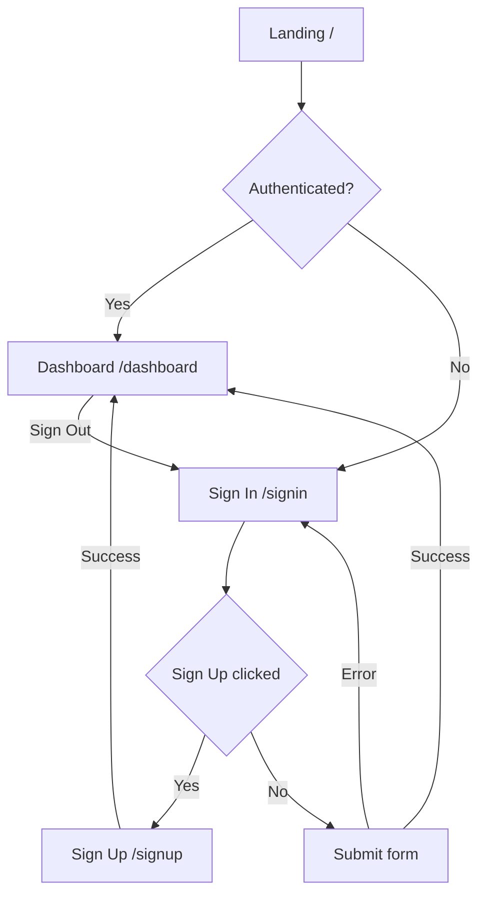

# UI Pages Specification

This document defines the application pages for the Full-Stack Todo Web Application, Phase II of "The Evolution of Todo" project.

## Overview

| Attribute | Value |
|-----------|-------|
| **Framework** | Next.js 16+ (App Router) |
| **Routing** | File-based with route groups |
| **Status** | Draft |

---

## Page Architecture

### Design Principles

| Principle | Description |
|-----------|-------------|
| **Server Components** | Use server components by default for performance |
| **Client Components** | Only use client components when interactivity needed |
| **Route Groups** | Organize pages into logical groups |
| **Protected Routes** | Require authentication for dashboard pages |

---

## Page Structure

```
app/
├── layout.tsx (root layout)
├── page.tsx (landing/home)
├── (auth)/
│   ├── layout.tsx (auth layout)
│   ├── signin/
│   │   └── page.tsx
│   └── signup/
│       └── page.tsx
└── dashboard/
    ├── layout.tsx (dashboard layout)
    └── page.tsx (main dashboard)
```

### Route Group Explanation

| Route Group | Purpose | Layout |
|-------------|---------|--------|
| (auth) | Authentication pages (signin, signup) | Auth-specific layout |
| dashboard | Protected pages | Dashboard layout with navigation |

---

## Pages

### 1. Landing Page (/)

**File:** `app/page.tsx`
**Type:** Public page (Server Component)

#### Purpose

- Welcome page for unauthenticated users
- Marketing/intro content about the app

#### Content

```tsx
// app/page.tsx
import Link from 'next/link'

export default function LandingPage() {
  return (
    <div className="min-h-screen bg-gradient-to-b from-blue-50 to-white">
      {/* Hero Section */}
      <section className="max-w-7xl mx-auto px-4 py-20 text-center">
        <h1 className="text-5xl font-bold text-gray-900 mb-6">
          Manage Your Tasks with Ease
        </h1>
        <p className="text-xl text-gray-600 mb-8 max-w-2xl mx-auto">
          The Evolution of Todo helps you stay organized, track progress,
          and accomplish your goals. Built with modern technology for
          a seamless experience.
        </p>

        <div className="flex gap-4 justify-center">
          <Link
            href="/signup"
            className="bg-blue-600 text-white px-8 py-3 rounded-lg text-lg font-medium hover:bg-blue-700 transition-colors"
          >
            Get Started
          </Link>
          <Link
            href="/signin"
            className="bg-white text-blue-600 border border-blue-600 px-8 py-3 rounded-lg text-lg font-medium hover:bg-blue-50 transition-colors"
          >
            Sign In
          </Link>
        </div>
      </section>

      {/* Features Section */}
      <section className="max-w-7xl mx-auto px-4 py-16">
        <h2 className="text-3xl font-bold text-center mb-12">
          Key Features
        </h2>

        <div className="grid md:grid-cols-3 gap-8">
          {/* Feature 1 */}
          <div className="bg-white rounded-xl shadow-md p-6">
            <div className="h-12 w-12 bg-blue-100 rounded-lg flex items-center justify-center mb-4">
              <svg className="w-6 h-6 text-blue-600" fill="none" stroke="currentColor" viewBox="0 0 24 24">
                <path strokeLinecap="round" strokeLinejoin="round" strokeWidth={2} d="M9 5H7a2 2 0 00-2 2v12a2 2 0 002 2h10a2 2 0 002-2V7a2 2 0 00-2-2h-2M9 5a2 2 0 002 2h2a2 2 0 002-2M9 5a2 2 0 012-2h2a2 2 0 012 2" />
              </svg>
            </div>
            <h3 className="text-xl font-semibold mb-2">Easy Task Management</h3>
            <p className="text-gray-600">
              Create, edit, and delete tasks with a simple and intuitive interface.
            </p>
          </div>

          {/* Feature 2 */}
          <div className="bg-white rounded-xl shadow-md p-6">
            <div className="h-12 w-12 bg-green-100 rounded-lg flex items-center justify-center mb-4">
              <svg className="w-6 h-6 text-green-600" fill="none" stroke="currentColor" viewBox="0 0 24 24">
                <path strokeLinecap="round" strokeLinejoin="round" strokeWidth={2} d="M12 15v2m-6 4h12a2 2 0 002-2v-6a2 2 0 00-2-2H6a2 2 0 00-2 2v6a2 2 0 002 2zm10-10V7a4 4 0 00-8 0v4h8z" />
              </svg>
            </div>
            <h3 className="text-xl font-semibold mb-2">Secure & Private</h3>
            <p className="text-gray-600">
              Your data is protected with secure authentication and encrypted storage.
            </p>
          </div>

          {/* Feature 3 */}
          <div className="bg-white rounded-xl shadow-md p-6">
            <div className="h-12 w-12 bg-purple-100 rounded-lg flex items-center justify-center mb-4">
              <svg className="w-6 h-6 text-purple-600" fill="none" stroke="currentColor" viewBox="0 0 24 24">
                <path strokeLinecap="round" strokeLinejoin="round" strokeWidth={2} d="M12 18h.01M8 21h8a2 2 0 002-2V5a2 2 0 00-2-2H8a2 2 0 00-2 2v14a2 2 0 002 2z" />
              </svg>
            </div>
            <h3 className="text-xl font-semibold mb-2">Access Anywhere</h3>
            <p className="text-gray-600">
              Use on any device - desktop, tablet, or mobile with responsive design.
            </p>
          </div>
        </div>
      </section>

      {/* Footer */}
      <footer className="bg-gray-900 text-white py-8">
        <div className="max-w-7xl mx-auto px-4 text-center">
          <p className="text-gray-400">
            Built with Next.js, FastAPI, and SQLModel
          </p>
          <p className="text-gray-500 text-sm mt-2">
            Phase II - Full-Stack Web Application
          </p>
        </div>
      </footer>
    </div>
  )
}
```

#### Behavior

| Condition | Action |
|-----------|--------|
| User logged in | Redirect to `/dashboard` |
| Mobile | Responsive layout |
| First load | Static generation (SSG) |

---

### 2. Sign Up Page (/signup)

**File:** `app/(auth)/signup/page.tsx`
**Type:** Public page (Client Component)
**Route Group:** `(auth)`

#### Purpose

- User registration

#### Layout

```tsx
// app/(auth)/signup/page.tsx
import { SignUpForm } from '@/app/components/SignUpForm'

export default function SignUpPage() {
  return (
    <div className="min-h-screen bg-gray-50 flex flex-col justify-center py-12 sm:px-6 lg:px-8">
      <div className="sm:mx-auto sm:w-full sm:max-w-md">
        <Link href="/" className="block text-center">
          <h1 className="text-3xl font-bold text-blue-600">Todo App</h1>
        </Link>
        <h2 className="mt-6 text-center text-3xl font-extrabold text-gray-900">
          Create your account
        </h2>
        <p className="mt-2 text-center text-sm text-gray-600">
          Already have an account?{' '}
          <Link href="/signin" className="font-medium text-blue-600 hover:text-blue-500">
            Sign in
          </Link>
        </p>
      </div>

      <div className="mt-8 sm:mx-auto sm:w-full sm:max-w-md">
        <div className="bg-white py-8 px-4 shadow sm:rounded-lg sm:px-10">
          <SignUpForm />
        </div>
      </div>
    </div>
  )
}
```

#### Form Fields

| Field | Type | Validation | Required |
|-------|------|------------|----------|
| Name | text | min 2 chars | Yes |
| Email | email | valid format | Yes |
| Password | password | min 8 chars | Yes |
| Confirm Password | password | must match password | Yes |

#### Behavior

| Scenario | Action |
|----------|--------|
| Client validation error | Show inline error message |
| API error (email exists) | Show error below field |
| Success | Redirect to `/dashboard` |
| Already logged in | Redirect to `/dashboard` |

---

### 3. Sign In Page (/signin)

**File:** `app/(auth)/signin/page.tsx`
**Type:** Public page (Client Component)
**Route Group:** `(auth)`

#### Purpose

- User login

#### Layout

```tsx
// app/(auth)/signin/page.tsx
import { SignInForm } from '@/app/components/SignInForm'

export default function SignInPage() {
  return (
    <div className="min-h-screen bg-gray-50 flex flex-col justify-center py-12 sm:px-6 lg:px-8">
      <div className="sm:mx-auto sm:w-full sm:max-w-md">
        <Link href="/" className="block text-center">
          <h1 className="text-3xl font-bold text-blue-600">Todo App</h1>
        </Link>
        <h2 className="mt-6 text-center text-3xl font-extrabold text-gray-900">
          Sign in to your account
        </h2>
        <p className="mt-2 text-center text-sm text-gray-600">
          Don't have an account?{' '}
          <Link href="/signup" className="font-medium text-blue-600 hover:text-blue-500">
            Sign up
          </Link>
        </p>
      </div>

      <div className="mt-8 sm:mx-auto sm:w-full sm:max-w-md">
        <div className="bg-white py-8 px-4 shadow sm:rounded-lg sm:px-10">
          <SignInForm />
        </div>
      </div>
    </div>
  )
}
```

#### Form Fields

| Field | Type | Validation | Required |
|-------|------|------------|----------|
| Email | email | valid format | Yes |
| Password | password | any | Yes |
| Remember me | checkbox | - | No |

#### Behavior

| Scenario | Action |
|----------|--------|
| Invalid credentials | Show 'Invalid email or password' |
| Success | Redirect to `/dashboard` or `returnUrl` |
| Already logged in | Redirect to `/dashboard` |

---

### 4. Dashboard Page (/dashboard)

**File:** `app/dashboard/page.tsx`
**Type:** Protected page (Server Component with Client Components)

#### Purpose

- Main application interface
- View and manage tasks
- Show user statistics and welcome message

#### Layout

```tsx
// app/dashboard/page.tsx
'use client'

import { useState, useEffect } from 'react'
import { AddTaskForm } from '@/app/components/AddTaskForm'
import { TaskList } from '@/app/components/TaskList'
import { useAuth } from '@/app/lib/auth'

interface Task {
  id: number
  user_id: string
  title: string
  description: string | null
  completed: boolean
  created_at: string
  updated_at: string
}

export default function DashboardPage() {
  const { user } = useAuth()
  const [tasks, setTasks] = useState<Task[]>([])
  const [isLoading, setIsLoading] = useState(true)
  const [error, setError] = useState<string | null>(null)

  // Fetch tasks on mount
  useEffect(() => {
    async function fetchTasks() {
      try {
        const response = await fetch('/api/tasks')
        if (!response.ok) throw new Error('Failed to fetch tasks')
        const data = await response.json()
        setTasks(data)
      } catch (err) {
        setError('Failed to load tasks. Please try again.')
      } finally {
        setIsLoading(false)
      }
    }

    fetchTasks()
  }, [])

  // Calculate task statistics
  const totalTasks = tasks.length
  const completedTasks = tasks.filter(task => task.completed).length
  const pendingTasks = totalTasks - completedTasks

  // Handle adding a new task
  async function handleAddTask(taskData: { title: string; description?: string }) {
    const response = await fetch('/api/tasks', {
      method: 'POST',
      headers: { 'Content-Type': 'application/json' },
      body: JSON.stringify(taskData),
    })

    if (!response.ok) {
      throw new Error('Failed to create task')
    }

    const newTask = await response.json()
    setTasks(prev => [newTask, ...prev])
  }

  // Handle toggling completion
  async function handleToggleTask(taskId: number) {
    const task = tasks.find(t => t.id === taskId)
    if (!task) return

    // Optimistic update
    setTasks(prev =>
      prev.map(t =>
        t.id === taskId ? { ...t, completed: !t.completed } : t
      )
    )

    try {
      await fetch(`/api/tasks/${taskId}/complete`, { method: 'PATCH' })
    } catch (err) {
      // Revert on error
      setTasks(prev =>
        prev.map(t =>
          t.id === taskId ? { ...t, completed: task.completed } : t
        )
      )
    }
  }

  // Handle deleting a task
  async function handleDeleteTask(taskId: number) {
    // Optimistic update
    setTasks(prev => prev.filter(t => t.id !== taskId))

    try {
      await fetch(`/api/tasks/${taskId}`, { method: 'DELETE' })
    } catch (err) {
      // Revert on error (would need to refetch)
    }
  }

  if (isLoading) {
    return (
      <div className="max-w-4xl mx-auto px-4 py-8">
        <div className="animate-pulse space-y-4">
          <div className="h-8 bg-gray-200 rounded w-1/4"></div>
          <div className="h-32 bg-gray-200 rounded"></div>
          <div className="h-32 bg-gray-200 rounded"></div>
        </div>
      </div>
    )
  }

  if (error) {
    return (
      <div className="max-w-4xl mx-auto px-4 py-8">
        <div className="bg-red-50 border border-red-200 rounded-lg p-4">
          <p className="text-red-600">{error}</p>
          <button
            onClick={() => window.location.reload()}
            className="mt-2 text-red-600 hover:text-red-800 underline"
          >
            Try again
          </button>
        </div>
      </div>
    )
  }

  return (
    <div className="max-w-4xl mx-auto px-4 py-8">
      {/* Welcome message with user name */}
      <h1 className="text-3xl font-bold text-gray-900 mb-6">
        Welcome, {user?.name || user?.email}!
      </h1>

      {/* Task statistics */}
      <div className="grid grid-cols-1 md:grid-cols-3 gap-4 mb-8">
        <div className="bg-white rounded-lg shadow-md p-4 text-center">
          <p className="text-2xl font-bold text-blue-600">{totalTasks}</p>
          <p className="text-gray-600">Total Tasks</p>
        </div>
        <div className="bg-white rounded-lg shadow-md p-4 text-center">
          <p className="text-2xl font-bold text-green-600">{completedTasks}</p>
          <p className="text-gray-600">Completed</p>
        </div>
        <div className="bg-white rounded-lg shadow-md p-4 text-center">
          <p className="text-2xl font-bold text-yellow-600">{pendingTasks}</p>
          <p className="text-gray-600">Pending</p>
        </div>
      </div>

      {/* Quick add task button */}
      <div className="mb-6">
        <button
          onClick={() => document.getElementById('add-task-form')?.scrollIntoView({ behavior: 'smooth' })}
          className="bg-blue-600 text-white px-4 py-2 rounded-lg hover:bg-blue-700 transition-colors"
        >
          + Add New Task
        </button>
      </div>

      {/* Filter and sort controls */}
      <div className="flex justify-between items-center mb-6">
        <div className="flex gap-2">
          <button className="px-3 py-1 bg-gray-200 rounded-lg text-sm">All</button>
          <button className="px-3 py-1 bg-white border border-gray-300 rounded-lg text-sm">Pending</button>
          <button className="px-3 py-1 bg-white border border-gray-300 rounded-lg text-sm">Completed</button>
        </div>
        <div className="flex gap-2">
          <select className="border border-gray-300 rounded-lg px-3 py-1 text-sm">
            <option>Sort by Date</option>
            <option>Sort by Title</option>
            <option>Sort by Priority</option>
          </select>
        </div>
      </div>

      <div className="space-y-6">
        {/* Add Task Form */}
        <div id="add-task-form">
          <AddTaskForm onSubmit={handleAddTask} />
        </div>

        {/* Task List */}
        <TaskList
          tasks={tasks}
          onTaskToggle={handleToggleTask}
          onTaskDelete={handleDeleteTask}
        />
      </div>
    </div>
  )
}
```

#### Behavior

| Scenario | Action |
|----------|--------|
| Not authenticated | Redirect to `/signin` |
| Loading | Show skeleton loaders |
| Empty tasks | Show empty state illustration |
| Task operations | Optimistic UI updates |

---

### 5. New Task Page (/tasks/new)

**File:** `app/tasks/new/page.tsx`
**Type:** Protected page (Client Component)

#### Purpose

- Create new task with full-screen form

#### Layout

```tsx
// app/tasks/new/page.tsx
'use client'

import { useState } from 'react'
import { TaskForm } from '@/app/components/TaskForm'
import { useRouter } from 'next/navigation'

export default function NewTaskPage() {
  const router = useRouter()
  const [isSubmitting, setIsSubmitting] = useState(false)

  const handleSubmit = async (taskData: { title: string; description?: string }) => {
    setIsSubmitting(true)
    try {
      const response = await fetch('/api/tasks', {
        method: 'POST',
        headers: { 'Content-Type': 'application/json' },
        body: JSON.stringify(taskData),
      })

      if (!response.ok) throw new Error('Failed to create task')

      // Navigate back to dashboard after successful creation
      router.push('/dashboard')
      router.refresh()
    } catch (error) {
      console.error('Error creating task:', error)
      setIsSubmitting(false)
    }
  }

  const handleCancel = () => {
    // Go back to previous page or dashboard
    router.back()
  }

  return (
    <div className="max-w-2xl mx-auto px-4 py-8">
      <div className="mb-6">
        <button
          onClick={handleCancel}
          className="flex items-center text-blue-600 hover:text-blue-800"
        >
          <svg className="w-5 h-5 mr-1" fill="none" stroke="currentColor" viewBox="0 0 24 24">
            <path strokeLinecap="round" strokeLinejoin="round" strokeWidth={2} d="M10 19l-7-7m0 0l7-7m-7 7h18" />
          </svg>
          Back to Dashboard
        </button>
      </div>

      <div className="bg-white rounded-lg shadow-md p-6">
        <h1 className="text-2xl font-bold text-gray-900 mb-6">Create New Task</h1>

        <TaskForm
          onSubmit={handleSubmit}
          onCancel={handleCancel}
          loading={isSubmitting}
        />
      </div>
    </div>
  )
}
```

#### Behavior

| Scenario | Action |
|----------|--------|
| Not authenticated | Redirect to `/signin` |
| Submit success | Navigate to `/dashboard` |
| Cancel | Navigate back to previous page |

---

### 6. Edit Task Page (/tasks/[id]/edit)

**File:** `app/tasks/[id]/page.tsx`
**Type:** Protected page (Client Component)

#### Purpose

- Edit existing task with pre-filled form data

#### Layout

```tsx
// app/tasks/[id]/page.tsx
'use client'

import { useState, useEffect } from 'react'
import { TaskForm } from '@/app/components/TaskForm'
import { useRouter } from 'next/navigation'
import { useAuth } from '@/app/lib/auth'

interface Task {
  id: number
  user_id: string
  title: string
  description: string | null
  completed: boolean
  created_at: string
  updated_at: string
}

export default function EditTaskPage({ params }: { params: { id: string } }) {
  const router = useRouter()
  const { user } = useAuth()
  const [task, setTask] = useState<Task | null>(null)
  const [isLoading, setIsLoading] = useState(true)
  const [isSubmitting, setIsSubmitting] = useState(false)
  const [error, setError] = useState<string | null>(null)

  useEffect(() => {
    async function fetchTask() {
      try {
        const response = await fetch(`/api/tasks/${params.id}`)
        if (!response.ok) throw new Error('Failed to fetch task')
        const data = await response.json()

        // Check if user owns the task
        if (data.user_id !== user?.id) {
          router.push('/dashboard')
          return
        }

        setTask(data)
      } catch (err) {
        setError('Failed to load task. Please try again.')
      } finally {
        setIsLoading(false)
      }
    }

    fetchTask()
  }, [params.id, user, router])

  const handleSubmit = async (taskData: { title: string; description?: string }) => {
    setIsSubmitting(true)
    try {
      const response = await fetch(`/api/tasks/${params.id}`, {
        method: 'PUT',
        headers: { 'Content-Type': 'application/json' },
        body: JSON.stringify(taskData),
      })

      if (!response.ok) throw new Error('Failed to update task')

      // Navigate back to dashboard after successful update
      router.push('/dashboard')
      router.refresh()
    } catch (error) {
      console.error('Error updating task:', error)
      setIsSubmitting(false)
    }
  }

  const handleCancel = () => {
    // Go back to dashboard
    router.push('/dashboard')
  }

  const handleDelete = async () => {
    if (confirm('Are you sure you want to delete this task?')) {
      try {
        const response = await fetch(`/api/tasks/${params.id}`, {
          method: 'DELETE',
        })

        if (!response.ok) throw new Error('Failed to delete task')

        // Navigate back to dashboard after successful deletion
        router.push('/dashboard')
        router.refresh()
      } catch (error) {
        console.error('Error deleting task:', error)
      }
    }
  }

  if (isLoading) {
    return (
      <div className="max-w-2xl mx-auto px-4 py-8">
        <div className="animate-pulse space-y-4">
          <div className="h-8 bg-gray-200 rounded w-1/4"></div>
          <div className="h-32 bg-gray-200 rounded"></div>
        </div>
      </div>
    )
  }

  if (error) {
    return (
      <div className="max-w-2xl mx-auto px-4 py-8">
        <div className="bg-red-50 border border-red-200 rounded-lg p-4">
          <p className="text-red-600">{error}</p>
          <button
            onClick={() => router.push('/dashboard')}
            className="mt-2 text-red-600 hover:text-red-800 underline"
          >
            Go to Dashboard
          </button>
        </div>
      </div>
    )
  }

  if (!task) {
    return (
      <div className="max-w-2xl mx-auto px-4 py-8">
        <div className="text-center">
          <p className="text-gray-600">Task not found</p>
          <button
            onClick={() => router.push('/dashboard')}
            className="mt-4 bg-blue-600 text-white px-4 py-2 rounded-lg hover:bg-blue-700"
          >
            Go to Dashboard
          </button>
        </div>
      </div>
    )
  }

  return (
    <div className="max-w-2xl mx-auto px-4 py-8">
      <div className="mb-6">
        <button
          onClick={handleCancel}
          className="flex items-center text-blue-600 hover:text-blue-800"
        >
          <svg className="w-5 h-5 mr-1" fill="none" stroke="currentColor" viewBox="0 0 24 24">
            <path strokeLinecap="round" strokeLinejoin="round" strokeWidth={2} d="M10 19l-7-7m0 0l7-7m-7 7h18" />
          </svg>
          Back to Dashboard
        </button>
      </div>

      <div className="bg-white rounded-lg shadow-md p-6">
        <h1 className="text-2xl font-bold text-gray-900 mb-6">Edit Task</h1>

        <TaskForm
          initialData={task}
          onSubmit={handleSubmit}
          onCancel={handleCancel}
          loading={isSubmitting}
        />

        <div className="mt-6 pt-6 border-t border-gray-200">
          <button
            onClick={handleDelete}
            className="text-red-600 hover:text-red-800 font-medium"
          >
            Delete Task
          </button>
        </div>
      </div>
    </div>
  )
}
```

#### Behavior

| Scenario | Action |
|----------|--------|
| Not authenticated | Redirect to `/signin` |
| Task not found | Show error and redirect to dashboard |
| Submit success | Navigate to `/dashboard` |
| Delete confirmed | Delete task and navigate to `/dashboard` |
| Cancel | Navigate to `/dashboard` |

---

### 7. Profile Page (/profile)

**File:** `app/profile/page.tsx`
**Type:** Protected page (Client Component)

#### Purpose

- Display user information
- Allow password change
- Account deletion

#### Layout

```tsx
// app/profile/page.tsx
'use client'

import { useState } from 'react'
import { useAuth } from '@/app/lib/auth'
import { useRouter } from 'next/navigation'

export default function ProfilePage() {
  const { user, updateUser, deleteUser } = useAuth()
  const router = useRouter()
  const [isChangingPassword, setIsChangingPassword] = useState(false)
  const [passwordData, setPasswordData] = useState({
    currentPassword: '',
    newPassword: '',
    confirmPassword: ''
  })
  const [passwordErrors, setPasswordErrors] = useState({
    currentPassword: '',
    newPassword: '',
    confirmPassword: ''
  })
  const [isSubmitting, setIsSubmitting] = useState(false)
  const [successMessage, setSuccessMessage] = useState('')

  const handleChangePassword = async (e: React.FormEvent) => {
    e.preventDefault()
    setIsSubmitting(true)

    // Reset errors
    setPasswordErrors({
      currentPassword: '',
      newPassword: '',
      confirmPassword: ''
    })

    let hasErrors = false

    // Validate passwords
    if (passwordData.newPassword.length < 8) {
      setPasswordErrors(prev => ({
        ...prev,
        newPassword: 'Password must be at least 8 characters'
      }))
      hasErrors = true
    }

    if (passwordData.newPassword !== passwordData.confirmPassword) {
      setPasswordErrors(prev => ({
        ...prev,
        confirmPassword: 'Passwords do not match'
      }))
      hasErrors = true
    }

    if (hasErrors) {
      setIsSubmitting(false)
      return
    }

    try {
      // API call to change password
      const response = await fetch('/api/users/change-password', {
        method: 'POST',
        headers: { 'Content-Type': 'application/json' },
        body: JSON.stringify({
          currentPassword: passwordData.currentPassword,
          newPassword: passwordData.newPassword
        }),
      })

      if (!response.ok) {
        const errorData = await response.json()
        throw new Error(errorData.message || 'Failed to change password')
      }

      setSuccessMessage('Password changed successfully!')
      setPasswordData({
        currentPassword: '',
        newPassword: '',
        confirmPassword: ''
      })
    } catch (error: any) {
      setPasswordErrors(prev => ({
        ...prev,
        currentPassword: error.message
      }))
    } finally {
      setIsSubmitting(false)
    }
  }

  const handleDeleteAccount = async () => {
    if (confirm('Are you sure you want to delete your account? This action cannot be undone.')) {
      try {
        await deleteUser()
        router.push('/')
        router.refresh()
      } catch (error) {
        console.error('Error deleting account:', error)
      }
    }
  }

  if (!user) {
    return null // Protected route will handle redirect
  }

  return (
    <div className="max-w-2xl mx-auto px-4 py-8">
      <h1 className="text-2xl font-bold text-gray-900 mb-6">Profile Settings</h1>

      <div className="space-y-8">
        {/* User Information Section */}
        <div className="bg-white rounded-lg shadow-md p-6">
          <h2 className="text-lg font-semibold text-gray-900 mb-4">User Information</h2>

          <div className="space-y-4">
            <div>
              <label className="block text-sm font-medium text-gray-700 mb-1">Name</label>
              <p className="text-gray-900">{user.name}</p>
            </div>

            <div>
              <label className="block text-sm font-medium text-gray-700 mb-1">Email</label>
              <p className="text-gray-900">{user.email}</p>
            </div>

            <div>
              <label className="block text-sm font-medium text-gray-700 mb-1">Join Date</label>
              <p className="text-gray-900">{new Date(user.created_at).toLocaleDateString()}</p>
            </div>
          </div>
        </div>

        {/* Change Password Section */}
        <div className="bg-white rounded-lg shadow-md p-6">
          <h2 className="text-lg font-semibold text-gray-900 mb-4">Change Password</h2>

          <form onSubmit={handleChangePassword} className="space-y-4">
            <div>
              <label htmlFor="currentPassword" className="block text-sm font-medium text-gray-700 mb-1">
                Current Password
              </label>
              <input
                type="password"
                id="currentPassword"
                value={passwordData.currentPassword}
                onChange={(e) => setPasswordData(prev => ({
                  ...prev,
                  currentPassword: e.target.value
                }))}
                className={`w-full border rounded-lg px-4 py-2 focus:ring-2 focus:ring-blue-500 focus:border-blue-500 ${
                  passwordErrors.currentPassword ? 'border-red-500' : 'border-gray-300'
                }`}
                required
              />
              {passwordErrors.currentPassword && (
                <p className="text-red-500 text-xs mt-1">{passwordErrors.currentPassword}</p>
              )}
            </div>

            <div>
              <label htmlFor="newPassword" className="block text-sm font-medium text-gray-700 mb-1">
                New Password
              </label>
              <input
                type="password"
                id="newPassword"
                value={passwordData.newPassword}
                onChange={(e) => setPasswordData(prev => ({
                  ...prev,
                  newPassword: e.target.value
                }))}
                className={`w-full border rounded-lg px-4 py-2 focus:ring-2 focus:ring-blue-500 focus:border-blue-500 ${
                  passwordErrors.newPassword ? 'border-red-500' : 'border-gray-300'
                }`}
                minLength={8}
                required
              />
              {passwordErrors.newPassword && (
                <p className="text-red-500 text-xs mt-1">{passwordErrors.newPassword}</p>
              )}
            </div>

            <div>
              <label htmlFor="confirmPassword" className="block text-sm font-medium text-gray-700 mb-1">
                Confirm New Password
              </label>
              <input
                type="password"
                id="confirmPassword"
                value={passwordData.confirmPassword}
                onChange={(e) => setPasswordData(prev => ({
                  ...prev,
                  confirmPassword: e.target.value
                }))}
                className={`w-full border rounded-lg px-4 py-2 focus:ring-2 focus:ring-blue-500 focus:border-blue-500 ${
                  passwordErrors.confirmPassword ? 'border-red-500' : 'border-gray-300'
                }`}
                required
              />
              {passwordErrors.confirmPassword && (
                <p className="text-red-500 text-xs mt-1">{passwordErrors.confirmPassword}</p>
              )}
            </div>

            <div className="flex gap-3">
              <button
                type="submit"
                disabled={isSubmitting}
                className="bg-blue-600 text-white px-4 py-2 rounded-lg hover:bg-blue-700 disabled:opacity-50 disabled:cursor-not-allowed"
              >
                {isSubmitting ? 'Changing Password...' : 'Change Password'}
              </button>

              {successMessage && (
                <p className="text-green-600 text-sm self-center">{successMessage}</p>
              )}
            </div>
          </form>
        </div>

        {/* Delete Account Section */}
        <div className="bg-white rounded-lg shadow-md p-6">
          <h2 className="text-lg font-semibold text-gray-900 mb-2">Delete Account</h2>
          <p className="text-gray-600 text-sm mb-4">
            Permanently remove your account and all associated data. This action cannot be undone.
          </p>

          <button
            onClick={handleDeleteAccount}
            className="text-red-600 hover:text-red-800 font-medium"
          >
            Delete Account
          </button>
        </div>
      </div>
    </div>
  )
}
```

#### Behavior

| Scenario | Action |
|----------|--------|
| Not authenticated | Redirect to `/signin` |
| Password change success | Show success message |
| Account deletion confirmed | Delete account and redirect to home |

---

## Route Protection

### Middleware Implementation

```tsx
// middleware.ts
import { NextRequest, NextResponse } from 'next/server'

// Protected routes that require authentication
const protectedRoutes = [
  '/dashboard',
  '/tasks',
  '/profile',
  '/api/tasks',
  '/api/users'
]

export function middleware(request: NextRequest) {
  // Check if the route is protected
  const isProtectedRoute = protectedRoutes.some(route =>
    request.nextUrl.pathname.startsWith(route)
  )

  // Get JWT token from cookies
  const token = request.cookies.get('token')?.value

  // If accessing a protected route without a token, redirect to sign in
  if (isProtectedRoute && !token) {
    // Preserve the return URL for post-login redirect
    const returnUrl = request.nextUrl.pathname + request.nextUrl.search
    const signInUrl = new URL('/signin', request.url)
    signInUrl.searchParams.set('return', returnUrl)

    return NextResponse.redirect(signInUrl)
  }

  // If user is logged in and trying to access auth pages, redirect to dashboard
  const isAuthRoute = ['/signin', '/signup'].includes(request.nextUrl.pathname)
  if (isAuthRoute && token) {
    // Redirect to return URL if available, otherwise to dashboard
    const returnUrl = request.nextUrl.searchParams.get('return')
    const redirectUrl = returnUrl || '/dashboard'
    return NextResponse.redirect(new URL(redirectUrl, request.url))
  }

  return NextResponse.next()
}

export const config = {
  matcher: [
    /*
     * Match all request paths except for the ones starting with:
     * - api (API routes)
     * - _next/static (static files)
     * - _next/image (image optimization files)
     * - favicon.ico (favicon file)
     */
    '/((?!api|_next/static|_next/image|favicon.ico).*)',
  ],
}
```

### Route Protection Details

| Route | Protection | Behavior |
|-------|------------|----------|
| `/` | Public | Redirect to `/dashboard` if authenticated |
| `/signin` | Public | Redirect to `/dashboard` if authenticated |
| `/signup` | Public | Redirect to `/dashboard` if authenticated |
| `/dashboard` | Protected | Redirect to `/signin` if unauthenticated |
| `/tasks/*` | Protected | Redirect to `/signin` if unauthenticated |
| `/profile` | Protected | Redirect to `/signin` if unauthenticated |

---

## Page Metadata

### Landing Page Metadata

```tsx
// app/page.tsx
import type { Metadata } from 'next'

export const metadata: Metadata = {
  title: 'The Evolution of Todo - Manage Your Tasks',
  description: 'Simple and powerful task management for everyone. Create, organize, and complete your tasks with ease.',
  keywords: 'todo, tasks, productivity, task management, organize',
  openGraph: {
    title: 'The Evolution of Todo - Manage Your Tasks',
    description: 'Simple and powerful task management for everyone.',
    type: 'website',
    url: 'https://todo-app.example.com',
  },
  twitter: {
    card: 'summary_large_image',
    title: 'The Evolution of Todo',
    description: 'Simple and powerful task management for everyone.',
  },
  robots: {
    index: true,
    follow: true,
  },
}
```

### Auth Pages Metadata

```tsx
// app/(auth)/signin/page.tsx
import type { Metadata } from 'next'

export const metadata: Metadata = {
  title: 'Sign In | The Evolution of Todo',
  description: 'Sign in to your account to manage your tasks',
  robots: {
    index: false,
    follow: false,
  },
}

// app/(auth)/signup/page.tsx
import type { Metadata } from 'next'

export const metadata: Metadata = {
  title: 'Sign Up | The Evolution of Todo',
  description: 'Create an account to manage your tasks',
  robots: {
    index: false,
    follow: false,
  },
}
```

### Protected Pages Metadata

```tsx
// app/dashboard/page.tsx
import type { Metadata } from 'next'

export const metadata: Metadata = {
  title: 'Dashboard | The Evolution of Todo',
  description: 'Manage your tasks and stay organized',
  robots: {
    index: false,
    follow: false,
  },
}

// app/tasks/new/page.tsx
import type { Metadata } from 'next'

export const metadata: Metadata = {
  title: 'Create New Task | The Evolution of Todo',
  description: 'Create a new task in your todo list',
  robots: {
    index: false,
    follow: false,
  },
}

// app/tasks/[id]/edit/page.tsx
import type { Metadata } from 'next'

export const metadata: Metadata = {
  title: 'Edit Task | The Evolution of Todo',
  description: 'Edit an existing task in your todo list',
  robots: {
    index: false,
    follow: false,
  },
}

// app/profile/page.tsx
import type { Metadata } from 'next'

export const metadata: Metadata = {
  title: 'Profile | The Evolution of Todo',
  description: 'Manage your profile and account settings',
  robots: {
    index: false,
    follow: false,
  },
}
```

---

## Layouts

### Root Layout (app/layout.tsx)

**Type:** Server Component

```tsx
// app/layout.tsx
import type { Metadata } from 'next'
import { Inter } from 'next/font/google'
import './globals.css'
import { AuthProvider } from '@/app/lib/auth-provider'

const inter = Inter({ subsets: ['latin'] })

export const metadata: Metadata = {
  title: 'The Evolution of Todo',
  description: 'A multi-phase todo application',
}

export default function RootLayout({
  children,
}: {
  children: React.ReactNode
}) {
  return (
    <html lang="en">
      <body className={inter.className}>
        <AuthProvider>
          {children}
        </AuthProvider>
      </body>
    </html>
  )
}
```

---

### Auth Layout (app/(auth)/layout.tsx)

**Type:** Server Component

```tsx
// app/(auth)/layout.tsx
import Link from 'next/link'

export default function AuthLayout({
  children,
}: {
  children: React.ReactNode
}) {
  return (
    <div className="min-h-screen bg-gray-50">
      {/* Simple header with logo only */}
      <header className="bg-white shadow-sm">
        <div className="max-w-7xl mx-auto px-4 py-4">
          <Link href="/" className="text-xl font-bold text-blue-600">
            Todo App
          </Link>
        </div>
      </header>

      {/* Main content */}
      <main>
        {children}
      </main>
    </div>
  )
}
```

---

### Dashboard Layout (app/dashboard/layout.tsx)

**Type:** Server Component with Client Navigation

```tsx
// app/dashboard/layout.tsx
import { Navigation } from '@/app/components/Navigation'

export default function DashboardLayout({
  children,
}: {
  children: React.ReactNode
}) {
  return (
    <div className="min-h-screen bg-gray-50">
      <Navigation />
      <main>
        {children}
      </main>
    </div>
  )
}
```

---

## Route Protection

### Protected Routes

| Route | Protection |
|-------|------------|
| `/dashboard` | Requires authentication |
| `/dashboard/*` | Requires authentication |

### Protection Implementation

```tsx
// app/components/ProtectedRoute.tsx
'use client'

import { useAuth } from '@/app/lib/auth'
import { LoadingSpinner } from '@/app/components/LoadingSpinner'
import { Navigate } from 'next/navigation'

export function ProtectedRoute({ children }: { children: React.ReactNode }) {
  const { user, isLoading } = useAuth()

  if (isLoading) {
    return <LoadingSpinner />
  }

  if (!user) {
    return <Navigate href="/signin" replace />
  }

  return <>{children}</>
}
```

### Usage in Layout

```tsx
// app/dashboard/layout.tsx
import { ProtectedRoute } from '@/app/components/ProtectedRoute'

export default function DashboardLayout({
  children,
}: {
  children: React.ReactNode
}) {
  return (
    <ProtectedRoute>
      <div className="min-h-screen bg-gray-50">
        <Navigation />
        <main>{children}</main>
      </div>
    </ProtectedRoute>
  )
}
```

---

## Page Transitions

### Loading States

| Page | Loading Indicator |
|------|-------------------|
| Landing | Static (SSG) - instant |
| Sign Up | Spinner on submit button |
| Sign In | Spinner on submit button |
| Dashboard | Skeleton loaders |

### Navigation Flow



---

## Navigation Flow

### User Journey Diagram

```
Landing (/)
│
├── Sign Up (/signup) ──────────────┐
│   └── Success ──> Dashboard (/dashboard)
│
└── Sign In (/signin) ──────────────┤
    └── Success ──> Dashboard (/dashboard)

Dashboard (/dashboard)
│
└── Sign Out ──> Landing (/) or Sign In (/signin)
```

### Navigation Flow Description

| From | To | Trigger |
|------|-----|---------|
| Landing (/) | Sign Up (/signup) | Click "Get Started" button |
| Landing (/) | Sign In (/signin) | Click "Sign In" button |
| Sign Up (/signup) | Dashboard (/dashboard) | Successful registration |
| Sign In (/signin) | Dashboard (/dashboard) | Successful login |
| Dashboard (/dashboard) | Sign In (/signin) | Click "Sign Out" |
| Any page | 404 | Invalid URL |
| Any page | Error | Unhandled exception |

---

## SEO & Metadata

### Landing Page

| Metadata | Value |
|----------|-------|
| Title | `Todo App - Manage Your Tasks` |
| Description | `Simple and powerful task management for everyone. Create, organize, and complete your tasks with ease.` |
| OG Title | `Todo App - Manage Your Tasks` |
| OG Description | `Simple and powerful task management` |
| OG Image | `/og-image.png` (optional) |
| Robots | `index, follow` |

```tsx
// app/page.tsx
export const metadata: Metadata = {
  title: 'Todo App - Manage Your Tasks',
  description: 'Simple and powerful task management for everyone. Create, organize, and complete your tasks with ease.',
  openGraph: {
    title: 'Todo App - Manage Your Tasks',
    description: 'Simple and powerful task management',
    type: 'website',
  },
}
```

---

### Auth Pages

| Page | Title | Robots |
|------|-------|--------|
| Sign Up (/signup) | `Sign Up | Todo App` | `noindex, nofollow` |
| Sign In (/signin) | `Sign In | Todo App` | `noindex, nofollow` |

**Rationale:** Auth pages should not be indexed by search engines as they are user-specific and contain forms.

```tsx
// app/(auth)/signin/page.tsx
export const metadata: Metadata = {
  title: 'Sign In | Todo App',
  robots: 'noindex, nofollow',
}
```

---

### Dashboard Page

| Metadata | Value |
|----------|-------|
| Title | `Dashboard | Todo App` |
| Description | `Manage your tasks and stay organized` |
| Robots | `noindex` |

**Rationale:** Dashboard contains user-specific data and should not be indexed.

```tsx
// app/dashboard/page.tsx
export const metadata: Metadata = {
  title: 'Dashboard | Todo App',
  description: 'Manage your tasks and stay organized',
  robots: 'noindex',
}
```

---

## Error Handling

### 404 Page (app/not-found.tsx)

**File:** `app/not-found.tsx`

```tsx
// app/not-found.tsx
import Link from 'next/link'

export default function NotFound() {
  return (
    <div className="min-h-screen flex items-center justify-center bg-gray-50">
      <div className="text-center">
        <h1 className="text-6xl font-bold text-gray-900 mb-4">404</h1>
        <p className="text-xl text-gray-600 mb-8">Page not found</p>
        <p className="text-gray-500 mb-8">
          Sorry, we couldn't find the page you're looking for.
        </p>
        <div className="flex gap-4 justify-center">
          <Link
            href="/"
            className="bg-blue-600 text-white px-6 py-3 rounded-lg hover:bg-blue-700 transition-colors"
          >
            Go Home
          </Link>
          <Link
            href="/dashboard"
            className="bg-white text-blue-600 border border-blue-600 px-6 py-3 rounded-lg hover:bg-blue-50 transition-colors"
          >
            Go to Dashboard
          </Link>
        </div>
      </div>
    </div>
  )
}
```

**Behavior:**
- Shown when user navigates to non-existent route
- Provides clear message and navigation options
- Clean, branded design

---

### Error Page (app/error.tsx)

**File:** `app/error.tsx`

```tsx
// app/error.tsx
'use client'

import { useEffect } from 'react'
import Link from 'next/link'

export default function Error({
  error,
  reset,
}: {
  error: Error & { digest?: string }
  reset: () => void
}) {
  useEffect(() => {
    // Log the error to an error reporting service
    console.error(error)
  }, [error])

  return (
    <div className="min-h-screen flex items-center justify-center bg-gray-50">
      <div className="text-center max-w-md">
        <h1 className="text-4xl font-bold text-gray-900 mb-4">
          Something went wrong
        </h1>
        <p className="text-gray-600 mb-8">
          We encountered an unexpected error. Please try again.
        </p>

        {process.env.NODE_ENV === 'development' && error.message && (
          <div className="bg-red-50 border border-red-200 rounded-lg p-4 mb-8 text-left">
            <p className="text-red-600 text-sm font-mono">{error.message}</p>
            {error.digest && (
              <p className="text-red-400 text-xs mt-2">Error ID: {error.digest}</p>
            )}
          </div>
        )}

        <div className="flex gap-4 justify-center">
          <button
            onClick={() => reset()}
            className="bg-blue-600 text-white px-6 py-3 rounded-lg hover:bg-blue-700 transition-colors"
          >
            Try Again
          </button>
          <Link
            href="/dashboard"
            className="bg-white text-blue-600 border border-blue-600 px-6 py-3 rounded-lg hover:bg-blue-50 transition-colors"
          >
            Go to Dashboard
          </Link>
        </div>
      </div>
    </div>
  )
}
```

**Behavior:**
- Shown when an unhandled error occurs
- Provides retry button
- Shows error details in development only
- Logs error for debugging

---

## Loading States

### Page Loading (app/loading.tsx)

**File:** `app/loading.tsx`

```tsx
// app/loading.tsx
export default function Loading() {
  return (
    <div className="min-h-screen flex items-center justify-center bg-gray-50">
      <div className="text-center">
        <div className="inline-block animate-spin rounded-full h-12 w-12 border-4 border-blue-600 border-t-transparent"></div>
        <p className="mt-4 text-gray-600">Loading...</p>
      </div>
    </div>
  )
}
```

**Behavior:**
- Shown during Next.js page transitions
- Full-page loading spinner
- Clean, branded design
- Fast transitions (less than 300ms for smooth UX)

---

### Component Loading

#### Skeleton Loader for Task List

```tsx
// app/components/TaskListSkeleton.tsx
export function TaskListSkeleton() {
  return (
    <div className="space-y-4">
      {/* Add Task Form Skeleton */}
      <div className="bg-white rounded-lg shadow-md p-6 animate-pulse">
        <div className="h-6 bg-gray-200 rounded w-1/4 mb-4"></div>
        <div className="h-10 bg-gray-200 rounded mb-4"></div>
        <div className="h-24 bg-gray-200 rounded"></div>
      </div>

      {/* Task Item Skeletons */}
      {[1, 2, 3].map((i) => (
        <div
          key={i}
          className="bg-white rounded-lg shadow-md p-4 animate-pulse"
        >
          <div className="flex items-center gap-4">
            <div className="h-5 w-5 bg-gray-200 rounded"></div>
            <div className="flex-1">
              <div className="h-5 bg-gray-200 rounded w-3/4 mb-2"></div>
              <div className="h-4 bg-gray-200 rounded w-1/2"></div>
            </div>
          </div>
        </div>
      ))}
    </div>
  )
}
```

**Usage:**
```tsx
// In Dashboard page
if (isLoading) {
  return <TaskListSkeleton />
}
```

#### Spinner for Form Submissions

```tsx
// app/components/ui/LoadingButton.tsx
interface LoadingButtonProps extends React.ButtonHTMLAttributes<HTMLButtonElement> {
  isLoading: boolean
  children: React.ReactNode
}

export function LoadingButton({ isLoading, children, disabled, ...props }: LoadingButtonProps) {
  return (
    <button
      disabled={isLoading || disabled}
      className={`
        relative px-4 py-2 rounded-lg font-medium text-white
        ${isLoading || disabled ? 'bg-blue-400 cursor-not-allowed' : 'bg-blue-600 hover:bg-blue-700'}
        transition-colors
      `}
      {...props}
    >
      {isLoading && (
        <span className="absolute left-3 top-1/2 -translate-y-1/2">
          <svg className="animate-spin h-5 w-5 text-white" viewBox="0 0 24 24">
            <circle
              className="opacity-25"
              cx="12"
              cy="12"
              r="10"
              stroke="currentColor"
              strokeWidth="4"
              fill="none"
            />
            <path
              className="opacity-75"
              fill="currentColor"
              d="M4 12a8 8 0 018-8V0C5.373 0 0 5.373 0 12h4zm2 5.291A7.962 7.962 0 014 12H0c0 3.042 1.135 5.824 3 7.938l3-2.647z"
            />
          </svg>
        </span>
      )}
      <span className={isLoading ? 'pl-6' : ''}>{children}</span>
    </button>
  )
}
```

**Usage:**
```tsx
<LoadingButton isLoading={isSubmitting} type="submit">
  {isSubmitting ? 'Signing in...' : 'Sign In'}
</LoadingButton>
```

#### Progressive Loading

```tsx
// Load initial data, then progressively show content
export default function DashboardPage() {
  const [tasks, setTasks] = useState<Task[]>([])
  const [isInitialLoading, setIsInitialLoading] = useState(true)

  useEffect(() => {
    async function loadTasks() {
      const data = await fetchTasks()
      setTasks(data)
      setIsInitialLoading(false)
    }
    loadTasks()
  }, [])

  return (
    <div className="max-w-4xl mx-auto px-4 py-8">
      <h1 className="text-3xl font-bold mb-8">My Tasks</h1>

      {/* Show skeleton while initial loading */}
      {isInitialLoading ? (
        <TaskListSkeleton />
      ) : (
        <>
          <AddTaskForm />
          <TaskList tasks={tasks} />
        </>
      )}
    </div>
  )
}
```

---

## Related Documents

| Document | Path | Purpose |
|----------|------|---------|
| Components | `ui/components.md` | Component specifications |
| Architecture | `architecture.md` | System architecture |
| API Spec | `api/rest-endpoints.md` | API endpoints |
| Authentication | `features/authentication.md` | Auth flow |

---

## Version Information

| Item | Value |
|------|-------|
| Pages Specification | 1.0.0 |
| Status | Draft |
| Last Updated | 2026-01-07 |
